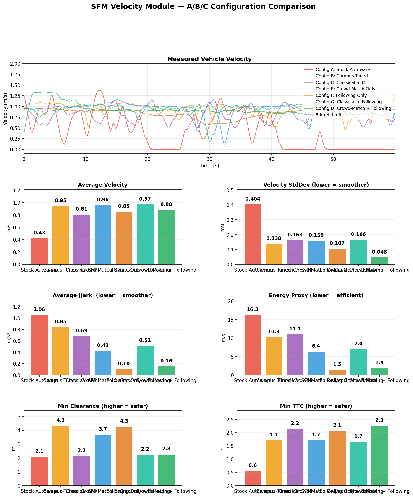
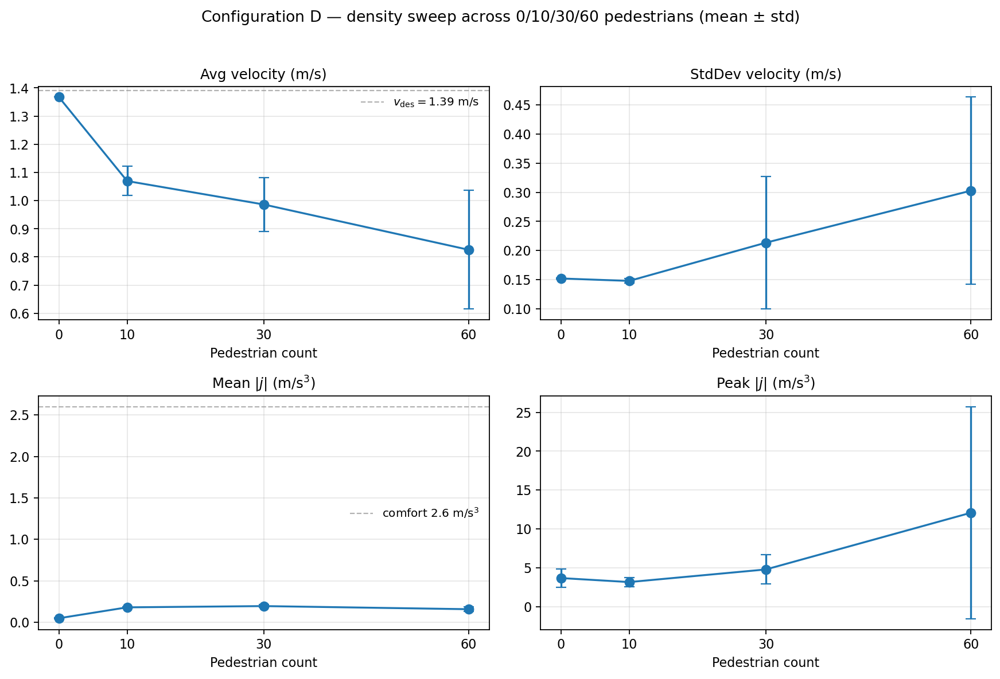
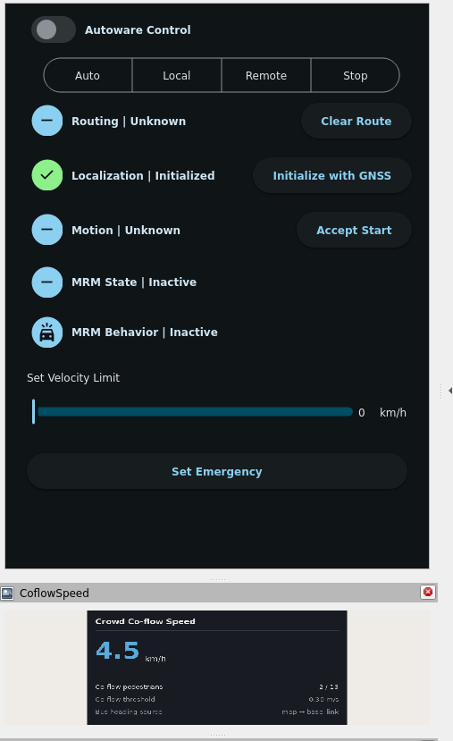
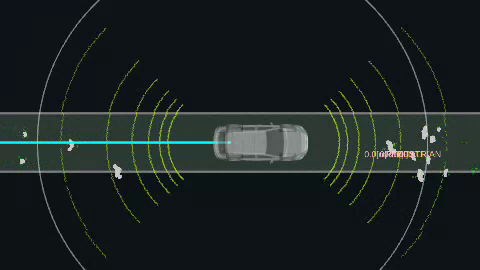

<h1 align="center">Crowd-Matching Velocity Planning for Autoware</h1>

<p align="center">
  A <code>behavior_velocity_planner</code> plugin that lets an autonomous shuttle drive
  <b>smoothly through pedestrians</b> on shared pathways, rather than stopping dead in front of every person.
</p>

<p align="center">
  
  
  
  
  
</p>

<p align="center">
  
  <br><i>Left: RViz, with lidar returns, tracked pedestrians and the live co-flow speed readout.
  Right: AWSIM, the shuttle matching crowd speed on a shared path.</i>
  <br><a href="docs/media/demo_full.mp4">▶ Full 43-second clip (MP4)</a>
</p>

Developed for the **nUWAy campus shuttle** as part of my Master's thesis at the University of Western
Australia. Out of the box, Autoware treats every detected pedestrian as a hard stop, which makes
shared-pathway driving impossible. This module replaces that binary stop/go behaviour with smooth,
human-aware velocity planning, and was validated through an 8-way comparative simulation study.

---

## The problem

Stock Autoware places 5 m stop margins in front of **all** detected pedestrians. On a campus footpath
where people are always present, the bus stops repeatedly and never makes meaningful progress.

## The approach

The module plans velocity (not steering) along the existing lanelet path, using two strategies:

- **Crowd-matching** *(recommended)*: detects co-flow pedestrians, computes their mean speed, and
  smoothly converges to match it, combined with proximity-based velocity attenuation that targets
  zero speed at a configurable minimum clearance.
- **Classical Social Force Model**: Helbing and Molnar (1995) repulsive forces, included for comparison.

A **dual-layer safety architecture** keeps it safe: the module handles smooth proximity attenuation
(10 m onset to a 3 m zero target), while Autoware's native `obstacle_stop` / `road_user_stop` remain
as a hard backup at 1.2 m.

## Results at a glance

Across an 8-way comparative study in AWSIM/Unity simulation with pedestrian-density sweeps (5 to 25
people), the crowd-matching plus proximity configuration:

- **Eliminated stop events:** 0 stops, versus 3 stops and 36% time stationary for stock Autoware
- **Smoothest velocity profile** of all configs (velocity StdDev 0.048)
- **Held mean time-to-collision above 2.3 s** throughout the density sweeps

<p align="center">
  
  
  <br>
  
  
</p>

---

## Where it fits in the Autoware planning pipeline

```
Mission Planner -> Behavior Path Planner -> Behavior Velocity Planner -> Motion Velocity Planner -> Velocity Smoother -> Control
                                                    ^
                                            This module runs HERE
                                      (modifies velocity along existing path)
```

The module modifies velocity only along the existing lanelet-following path. It does not alter
steering; Autoware's `behavior_path_planner` still handles lane following.

## Quick start

```bash
# 1. Clone into the Autoware workspace src/ directory
cd /path/to/autoware_ws/src
git clone <this-repo> autoware_behavior_velocity_sfm_module

# 2. Build (inside the Autoware Docker container)
cd /workspace
colcon build --packages-select autoware_behavior_velocity_sfm_module
source /workspace/install/setup.bash

# 3. Deploy (patches Autoware launch files + configs)
/workspace/src/autoware_behavior_velocity_sfm_module/scripts/deploy_sfm.sh enable

# 4. Launch Autoware normally
ros2 launch autoware_launch autoware.launch.xml data_path:=/autoware_data map_path:=/autoware_map
```

## Algorithm (crowd-matching mode)

1. **Pedestrian filtering:** pedestrians within `detection_radius` (15 m) from
   `/perception/object_recognition/objects`
2. **Co-flow detection:** project each pedestrian's velocity onto the ego forward direction; those
   with forward speed > `co_flow_threshold` (0.3 m/s) are co-flow
3. **Speed matching:** if ≥ `min_crowd_size` co-flow pedestrians exist, target velocity = their mean speed
4. **Crowd hold:** after the crowd disappears, ramp back to desired velocity over `crowd_hold_time` (1.5 s)
5. **Proximity attenuation:** quadratic distance scaling from `braking_distance` (10 m) to
   `min_clearance` (3 m), targeting zero velocity at min clearance
6. **Relaxation smoothing:** exponential convergence with time constant `relaxation_time` (2.0 s)

## Key parameters

All parameters live in `config/sfm.param.yaml` under the `sfm` namespace.

| Parameter | Default | Description |
|-----------|---------|-------------|
| `mode` | `crowd_matching` | Algorithm mode (crowd_matching / classical / following_only / …) |
| `desired_velocity` | 1.39 | Target speed with no crowd (m/s, = 5 km/h) |
| `relaxation_time` | 2.0 | Velocity convergence time constant (s) |
| `detection_radius` | 15.0 | Max distance to consider pedestrians (m) |
| `braking_distance` | 10.0 | Proximity attenuation onset distance (m) |
| `min_clearance` | 3.0 | Targets zero velocity at this distance (m) |
| `co_flow_threshold` | 0.3 | Min pedestrian forward speed counted as co-flow (m/s) |
| `min_crowd_size` | 1 | Min co-flow pedestrians to trigger crowd matching |

## Package structure

```
autoware_behavior_velocity_sfm_module/
├── src/
│   ├── manager.{hpp,cpp}   # Plugin manager + pluginlib export
│   └── scene.{hpp,cpp}     # Core crowd-matching algorithm
├── config/sfm.param.yaml   # Tunable parameters
├── scripts/                # Deployment + evaluation tooling
│   ├── deploy_sfm.sh        # Enable / disable / status / clean
│   ├── run_density_sweep.sh # Density sweep (5 to 25 peds)
│   ├── analyze_results.py   # Rosbag analysis + comparison plots
│   └── configs/             # The 8 study configurations
├── CMakeLists.txt · package.xml · plugins.xml
└── docs/                   # Architecture diagrams + media
```

## 8-way comparative study

| Config | Velocity model | Following controller | Key result |
|--------|---------------|---------------------|------------|
| A: Stock | None (5 m stops) | None | 3 stops, 36% stationary |
| B: Campus-tuned | None (0.8 m stops) | None | Drives, but no crowd awareness |
| C: Classical | Helbing repulsive | Off | Oscillates (feedback loop) |
| **D: Crowd-match + prox** | **Crowd-matching** | **Proximity attenuation** | **Best: StdDev 0.048, 0 stops** |
| E: Crowd-match only | Crowd-matching | Off | Good, but no safe following |
| F: Following only | None | Proximity attenuation | Follows, no speed matching |
| G: Classical + follow | Helbing repulsive | Proximity attenuation | Still oscillates |
| H: Crowd-match + PID | Crowd-matching | PID controller | 5x worse jerk |

## Built with

ROS 2 (Humble) · Autoware · C++17 · Python · AWSIM/Unity · Docker · pluginlib

## Reference

Helbing, D. and Molnar, P. (1995). *Social force model for pedestrian dynamics.* Physical Review E,
51(5), 4282-4286.

## About

Master's thesis project (Master of Professional Engineering, Mechanical) at the University of Western
Australia, on the nUWAy autonomous campus shuttle running the Autoware stack. Author: **Harry
Tolcher** · [GitHub](https://github.com/HTOLCH).

## License

Apache License 2.0
